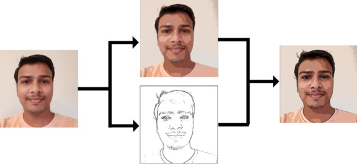
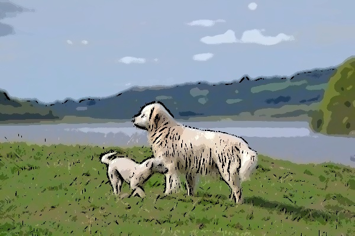

# Project Title
Image-Abstraction-Edge-Detection-and-Region-Smothing

## Running
python run.py -f IMAGE_FILE_PATH

## Output

here are some of the output generated

    

        
Input

        
    

    

        
Output

        
    

